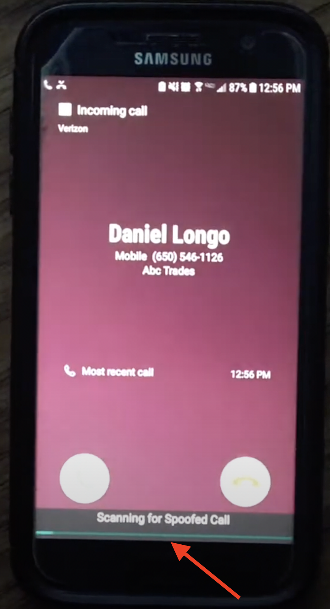

Most spam calls these days are spoofed, meaning the number displayed on one's phone is not the actual number calling them. Traditional spam detection apps use databases of spam phone numbers to identify spam calls, but spoofing circumvents this heuristic.  

We developed a novel protocol to identify spoofed calls by checking to see if the number displayed on a user's phone is in fact making an active call.  

We implemented our protocol in an Android app coded in Kotlin that automatically scans incoming calls.

Demo and about on YouTube here (as part of entry for Congressional App Challenge) [https://www.youtube.com/watch?v=Zbc1meqqGnA](https://www.youtube.com/watch?v=Zbc1meqqGnA)  

Won 3rd Place overall at Menlo Hacks 2019

